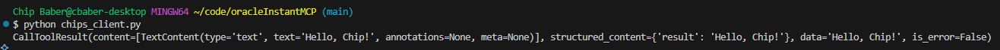
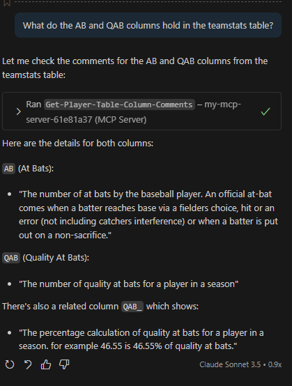
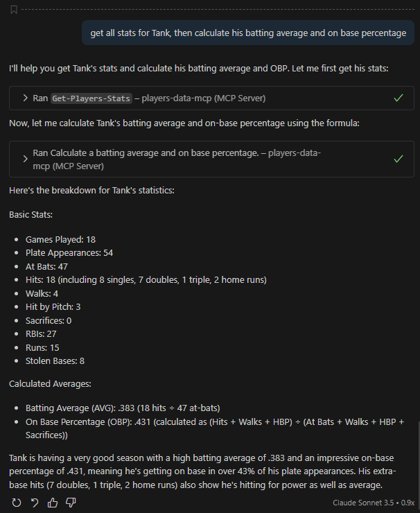

# Instuctions
This markdown will walk you through how to create your own MCP server in python to Oracle 26ai database running on OCI. 

# Pre-reqs
- If using windows install Git Bash. [https://gitforwindows.org/](https://gitforwindows.org/)
- Download and install the Oracle Instant Client, SQL*Plus and your 26ai Database Wallet. Please watch this instructional video: [https://youtu.be/DyJRgrMDPx8](https://youtu.be/DyJRgrMDPx8)
- Follow the steps in this video install Visual Studio Code, connect to co-pilot and Oracle VS Studio plugin. You can skip the creation of a database user and loading of data, that will be covered in the steps below specific to the MCP server creation. [https://www.youtube.com/watch?v=TvQb7H11zYM&list=PLsnBif_-5JnA8Hzvp8e1bQ3fo6VEvYEB0&index=4&pp=gAQBiAQB](https://www.youtube.com/watch?v=TvQb7H11zYM&list=PLsnBif_-5JnA8Hzvp8e1bQ3fo6VEvYEB0&index=4&pp=gAQBiAQB)


# Create a User in the Database
- Open Database Actions SQL Studio from your OCI console create the sample objects below for use in the example. As admin, create the players user for the sample demo. 


```
create user players identified by "{password}";
grant dwrole to players;
grant unlimited tablespace to players;
```

# Create Database Objects 
- Create a connection as players to your 26ai inside the VS Studio plugin. 


- As the players  Create a sample table called teamstats
```
 CREATE TABLE "TEAMSTATS" 
   (	"ID" NUMBER GENERATED BY DEFAULT ON NULL AS IDENTITY MINVALUE 1 MAXVALUE 9999999999999999999999999999 INCREMENT BY 1 START WITH 13 CACHE 20 NOORDER  NOCYCLE  NOKEEP  NOSCALE  NOT NULL ENABLE, 
	"JERSEY" NUMBER, 
	"NAME" VARCHAR2(100), 
	"GP" NUMBER, 
	"PA" NUMBER, 
	"AB" NUMBER, 
	"H" NUMBER, 
	"C1B" NUMBER, 
	"C2B" NUMBER, 
	"C3B" NUMBER, 
	"HR" NUMBER, 
	"RBI" NUMBER, 
	"R" NUMBER, 
	"BB" NUMBER, 
	"SO" NUMBER, 
	"K_L" NUMBER, 
	"HBP" NUMBER, 
	"SAC" NUMBER, 
	"SF" NUMBER, 
	"ROE" NUMBER, 
	"FC" NUMBER, 
	"SB" NUMBER, 
	"QAB" NUMBER, 
	"QAB_" NUMBER, 
	"LOB" NUMBER, 
	"XBH" NUMBER, 
	"TB" NUMBER, 
	"PS" NUMBER, 
	"AVG" NUMBER GENERATED ALWAYS AS (ROUND("H"/"AB",3)) VIRTUAL , 
	"OBP" NUMBER GENERATED ALWAYS AS (ROUND(("H"+"BB"+"HBP")/("AB"+"BB"+"HBP"+"SAC"),3)) VIRTUAL , 
	"SLG" NUMBER GENERATED ALWAYS AS (ROUND("TB"/"AB",3)) VIRTUAL , 
	"VIDEO" VARCHAR2(2500), 
	 PRIMARY KEY ("ID")
  USING INDEX  ENABLE
   ) ;
```

- Add the following table and column comments. 
```
COMMENT ON COLUMN "TEAMSTATS"."JERSEY" IS 'The jersey number of the player';
   COMMENT ON COLUMN "TEAMSTATS"."NAME" IS 'The name number of the baseball player';
   COMMENT ON COLUMN "TEAMSTATS"."GP" IS 'The number of games played by the baseball player';
   COMMENT ON COLUMN "TEAMSTATS"."PA" IS 'The number of plate appearances by the baseball player';
   COMMENT ON COLUMN "TEAMSTATS"."AB" IS 'The number of at bats by the baseball player. An official at-bat comes when a batter reaches base via a fielders choice, hit or an error (not including catchers interference) or when a batter is put out on a non-sacrifice.';
   COMMENT ON COLUMN "TEAMSTATS"."H" IS 'The number of hits by a player in a season';
   COMMENT ON COLUMN "TEAMSTATS"."C1B" IS 'The number of singles by a player in a season';
   COMMENT ON COLUMN "TEAMSTATS"."C2B" IS 'The number of doubles by a player in a season';
   COMMENT ON COLUMN "TEAMSTATS"."C3B" IS 'The number of triples by a player in a season';
   COMMENT ON COLUMN "TEAMSTATS"."HR" IS 'The number of homeruns by a player in a season';
   COMMENT ON COLUMN "TEAMSTATS"."RBI" IS 'The number of runs batted in by a player in a season';
   COMMENT ON COLUMN "TEAMSTATS"."R" IS 'total runs scored';
   COMMENT ON COLUMN "TEAMSTATS"."BB" IS 'The number of base on balls by a player in a season';
   COMMENT ON COLUMN "TEAMSTATS"."SO" IS 'The number of strikeouts by a player in a season';
   COMMENT ON COLUMN "TEAMSTATS"."K_L" IS 'Strikeouts looking (K_L) represents the number of times a batter strikes out without swinging at the final strike. It is a direct count and not derived from other columns.';
   COMMENT ON COLUMN "TEAMSTATS"."HBP" IS 'The number of hit by pitches by a player in a season';
   COMMENT ON COLUMN "TEAMSTATS"."SAC" IS 'Sacrifice (SAC) represents the number of times a batter advances a runner by sacrificing their at-bat, typically through a bunt or fly ball. It is a direct count and not derived from other columns.';
   COMMENT ON COLUMN "TEAMSTATS"."SF" IS 'Sacrifice flies (SF) represents the number of times a batter hits a fly ball that allows a runner to score while the batter is out. It is a direct count and not derived from other columns.';
   COMMENT ON COLUMN "TEAMSTATS"."ROE" IS 'Reached on error (ROE) represents the number of times a batter reaches base due to a fielding error by the opposing team. It is a direct count and not derived from other columns.';
   COMMENT ON COLUMN "TEAMSTATS"."FC" IS 'Fielder''s choice (FC) represents the number of times a batter reaches base due to a fielder choosing to make a play on another runner. It is a direct count and not derived from other columns.';
   COMMENT ON COLUMN "TEAMSTATS"."SB" IS 'total stolen bases by the player during the season.';
   COMMENT ON COLUMN "TEAMSTATS"."QAB" IS 'The number of quality at bats for a player in a season';
   COMMENT ON COLUMN "TEAMSTATS"."QAB_" IS 'The percentage calculation of quality at bats for a player in a season. for example 46.55 is 46.55% of quality at bats. ';
   COMMENT ON COLUMN "TEAMSTATS"."LOB" IS 'total runners left on base when the player was at bat during the season.';
   COMMENT ON COLUMN "TEAMSTATS"."XBH" IS 'total extra base hits by a player during the season.';
   COMMENT ON COLUMN "TEAMSTATS"."TB" IS 'Total bases (TB) represents the total number of bases a batter has gained from hits. It is calculated as the sum of singles (H - XBH - HR), doubles (2 * (C2B)), triples (3 * (C3B)), and home runs (4 * HR). Formula: TB = (H - XBH - HR) + (2 * C2B) + (3 * C3B) + (4 * HR).';
   COMMENT ON COLUMN "TEAMSTATS"."PS" IS 'Plate appearances per strikeout (PS) represents the average number of plate appearances a batter has before striking out. It is calculated as plate appearances (PA) divided by strikeouts (SO). Formula: PS = PA / SO.';
   COMMENT ON COLUMN "TEAMSTATS"."AVG" IS 'The batting average of the player rounded to 3 decimal places as calculated by the number of hits divided by the number of at bats in a season';
   COMMENT ON COLUMN "TEAMSTATS"."OBP" IS 'The on base percentage for player rounded to 3 decimal places as calculated by (H+BB+HBP)/(AB+BB+HBP+SAC) in a season';
   COMMENT ON COLUMN "TEAMSTATS"."SLG" IS 'Slugging percentage (SLG) is a measure of the batting productivity of a hitter. It is calculated as total bases (TB) divided by at-bats (AB). Formula: SLG = TB / AB.';
   COMMENT ON TABLE "TEAMSTATS"  IS 'This table the player statistics for the 2023 baseball season.';
```

- Insert some sample data in the table
```
begin
    insert into teamstats (id, name, gp, ab, r, h, c1b, c2b, c3b, hr, xbh, tb, rbi, bb, hbp, so, k_l, sb, sf, sac, roe, fc, lob, pa, qab, qab_, ps, jersey, video) 
    values (1, 'Nathaniel', 20, 49, 21, 19, 9, 6, 2, 2, 10, 35, 11, 5, 2, 11, 3, 11, 1, 1, 5, 1, 15, 58, 27, 46.55, 198, '4', '');
    insert into teamstats (id, name, gp, ab, r, h, c1b, c2b, c3b, hr, xbh, tb, rbi, bb, hbp, so, k_l, sb, sf, sac, roe, fc, lob, pa, qab, qab_, ps, jersey, video) 
    values (2, 'Jack', 14, 24, 9, 5, 4, 1, 0, 0, 1, 6, 1, 10, 0, 6, 3, 3, 0, 0, 0, 0, 23, 34, 21, 61.76, 159, '7', '');
    insert into teamstats (id, name, gp, ab, r, h, c1b, c2b, c3b, hr, xbh, tb, rbi, bb, hbp, so, k_l, sb, sf, sac, roe, fc, lob, pa, qab, qab_, ps, jersey, video) 
    values (3, 'Brodie', 20, 53, 30, 26, 15, 4, 3, 4, 11, 48, 22, 5, 3, 4, 0, 22, 1, 0, 5, 1, 16, 62, 35, 56.45, 225, '8', '');
    insert into teamstats (id, name, gp, ab, r, h, c1b, c2b, c3b, hr, xbh, tb, rbi, bb, hbp, so, k_l, sb, sf, sac, roe, fc, lob, pa, qab, qab_, ps, jersey, video) 
    values (4, 'Kellan', 20, 49, 20, 19, 9, 9, 0, 1, 10, 31, 11, 11, 1, 5, 1, 9, 0, 0, 4, 0, 24, 61, 28, 45.9, 231, '9', '');
    insert into teamstats (id, name, gp, ab, r, h, c1b, c2b, c3b, hr, xbh, tb, rbi, bb, hbp, so, k_l, sb, sf, sac, roe, fc, lob, pa, qab, qab_, ps, jersey, video) 
    values (5, 'Tank', 18, 47, 15, 18, 8, 7, 1, 2, 10, 33, 27, 4, 3, 4, 1, 8, 0, 0, 2, 2, 19, 54, 25, 46.3, 178, '11', 'https://youtu.be/kz1E99o0KEU');
    insert into teamstats (id, name, gp, ab, r, h, c1b, c2b, c3b, hr, xbh, tb, rbi, bb, hbp, so, k_l, sb, sf, sac, roe, fc, lob, pa, qab, qab_, ps, jersey, video) 
    values (6, 'Ben', 14, 25, 7, 8, 7, 1, 0, 0, 1, 9, 6, 3, 0, 4, 1, 0, 0, 0, 2, 1, 14, 28, 10, 35.71, 113, '17', '');
    insert into teamstats (id, name, gp, ab, r, h, c1b, c2b, c3b, hr, xbh, tb, rbi, bb, hbp, so, k_l, sb, sf, sac, roe, fc, lob, pa, qab, qab_, ps, jersey, video) 
    values (7, 'Noah', 20, 35, 7, 8, 7, 1, 0, 0, 1, 9, 3, 9, 0, 9, 2, 1, 1, 0, 1, 1, 22, 45, 23, 51.11, 180, '21', '');
    insert into teamstats (id, name, gp, ab, r, h, c1b, c2b, c3b, hr, xbh, tb, rbi, bb, hbp, so, k_l, sb, sf, sac, roe, fc, lob, pa, qab, qab_, ps, jersey, video) 
    values (8, 'Kaleb', 20, 46, 10, 14, 9, 3, 0, 2, 5, 23, 12, 9, 1, 8, 3, 6, 1, 1, 0, 0, 23, 58, 25, 43.1, 187, '22', '');
    insert into teamstats (id, name, gp, ab, r, h, c1b, c2b, c3b, hr, xbh, tb, rbi, bb, hbp, so, k_l, sb, sf, sac, roe, fc, lob, pa, qab, qab_, ps, jersey, video) 
    values (9, 'Chase', 20, 38, 11, 11, 8, 3, 0, 0, 3, 14, 8, 10, 1, 10, 5, 1, 0, 0, 0, 2, 29, 50, 22, 44, 205, '23', '');
    insert into teamstats (id, name, gp, ab, r, h, c1b, c2b, c3b, hr, xbh, tb, rbi, bb, hbp, so, k_l, sb, sf, sac, roe, fc, lob, pa, qab, qab_, ps, jersey, video) 
    values (10, 'Canir', 19, 32, 7, 6, 5, 1, 0, 0, 1, 7, 5, 10, 0, 10, 4, 3, 0, 0, 0, 1, 31, 42, 19, 45.24, 189, '27', '');
    insert into teamstats (id, name, gp, ab, r, h, c1b, c2b, c3b, hr, xbh, tb, rbi, bb, hbp, so, k_l, sb, sf, sac, roe, fc, lob, pa, qab, qab_, ps, jersey, video) 
    values (11, 'Matthew', 18, 36, 9, 12, 9, 3, 0, 0, 3, 15, 8, 8, 0, 6, 1, 1, 0, 0, 3, 2, 17, 44, 20, 45.45, 155, '28', '');
    insert into teamstats (id, name, gp, ab, r, h, c1b, c2b, c3b, hr, xbh, tb, rbi, bb, hbp, so, k_l, sb, sf, sac, roe, fc, lob, pa, qab, qab_, ps, jersey, video) 
    values (12, 'Charles', 20, 37, 9, 9, 8, 1, 0, 0, 1, 10, 5, 13, 2, 4, 1, 3, 0, 0, 3, 2, 18, 52, 24, 46.15, 194, '99', '');
    commit;
end;
/
```

- Create a procedure
```
CREATE OR REPLACE PROCEDURE myStats(
    p_atBats IN NUMBER,
    p_hits IN NUMBER,
    p_walks_hbp IN NUMBER,
    p_sac IN NUMBER,
    p_battingAvg OUT NUMBER,
    p_onBasePercentage OUT NUMBER
) IS
BEGIN
    -- Check for division by zero
    IF p_atBats = 0 THEN
        p_battingAvg := NULL;
    ELSE
        p_battingAvg := ROUND(p_hits / p_atBats, 3);
    END IF;

    -- Check for division by zero
    IF p_atBats + p_walks_hbp + p_sac = 0 THEN
        p_onBasePercentage := NULL;
    ELSE
        p_onBasePercentage := ROUND((p_hits + p_walks_hbp) / (p_atBats + p_walks_hbp + p_sac), 3);
    END IF;
END myStats;
/
```


# Test your login to the database via sqlplus
- From a bash or powershell connection test that your sqlplus connection works. 
Ex. sqlplus players@SLUGGERSAPEX_MEDIUM

```
sqlplus players@<your tnsnames entry>
```

# Install Required Python Libraries
- Open a Git Bash shell session inside Visual Studio Code and install the following python packages.
```
pip install oracledb
pip install fastmcp
pip install typing
```

- Create a new .demo_profile file inside your VS Code Directory and paste in the following 
```
# Oracle 26ai Autonomous Database Connection Settings
export DB_USER="players"  # Replace with your database username
export DB_PASS="<your pwd>"       # Replace with your database password
export DB_DSN="<your dsn>"        # Replace with your TNS name (e.g., luggersapex_low)
export WALLET_LOCATION="<your path to wallet>"  # Replace with the full path to your wallet directory ex. C:\Users\Chip Baber\code\db_wallets\Wallet_SluggersAPEX
export INSTANT_CLIENT_DIR="<your instant client dir>" #Replace with path to instant client. ex. C:\Oracle\instantclient-basic-windows.x64-23.9.0.25.07\instantclient_23_9

# Load additional local settings if they exist
if [ -f ~/.bashrc ]; then
   source ~/.bashrc
fi
```

- Test your login to the database via python.
```
python dbconnect.py
```

- With your connection in place lets now look at the basics of fastmcp. Open chips_server.py and review the code. This link is also helpful [https://gofastmcp.com/getting-started/quickstart](https://gofastmcp.com/getting-started/quickstart). Finally start your server. 

```
python chips_server.py
```

- Now open the file chips_client.py. This is an example client. Open a new terminal in VS Studio. Make the following client call, you should see the results pictured below. 

```
python chips_client.py
```



- To add your MCP Server to VS Code:
   - Create a new folder called .vscode
   - Create a new file called mcp.json
   - Click add server, select http
   - Paste in your local address. 

# Test in VS Code. 

- Click tools to see the current MCP servers. 
   
- View the MCP Server
   
- Type the # in the chat to see your MCP Server
   

- You can select it and ask a question or if your notes are good enough ask a question directly. Lets test our MCP server and newly created tools now. 

```
What do the AB and H columns do in the teamstats table
```



```
get all stats for Tank, then calculate his batting average and on base percentage
```

